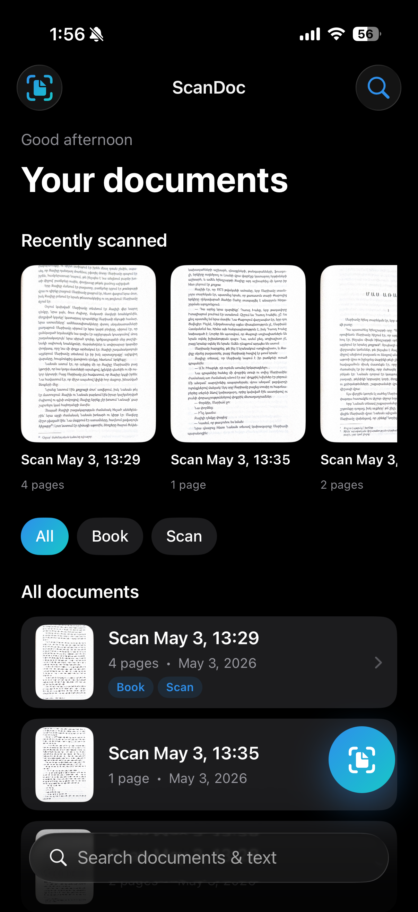
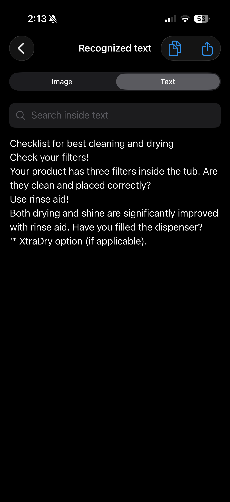
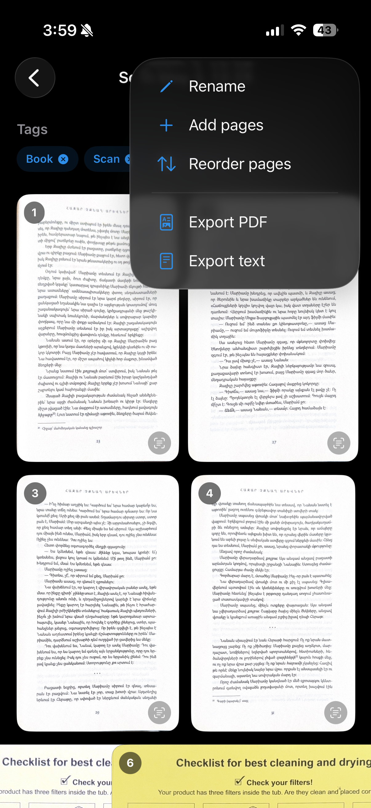

# ScanDoc

A production-quality iOS document scanner with OCR and PDF export, written in SwiftUI.

## Features

- **Camera Scanner** — automatic document edge detection, manual corner adjustment, perspective correction, and built-in filters (color / grayscale / B&W) powered by VisionKit's `VNDocumentCameraViewController`.
- **OCR (Text Recognition)** — Vision framework's `VNRecognizeTextRequest` (accurate revision 3) with editable text view, and in-image highlight overlays for matched words.
- **Document Management** — list, rename, delete, tag, and search documents. Recently scanned shelf for fast access.
- **PDF Export** — combine pages into A4 PDFs with `UIGraphicsPDFRenderer`. Share via the system share sheet or save to Files.
- **Multi-page Scanning** — capture multiple pages into a single document, reorder, or delete pages.
- **Filters & Editing** — Original, Enhanced, B&W, Grayscale (CoreImage). Rotate and re-save in place.
- **Full-text Search** — search across recognized OCR text with highlighted snippets.
- **Tagging System** — flat, lightweight tags per document with quick filtering on Home.
- **Offline-first** — everything runs on-device. No network required.
- **Light & Dark Mode** — adaptive system colors throughout.

## Screenshots

| Home | Scanner | OCR | Editor |
|------|---------|-----|--------|
|  |  |  |  |

## Architecture

MVVM with a coordinator-style `AppRouter`, lightweight DI container, and modular folders.

```
ScanDoc/
├── App/                 # Entry point, DI container, Router, RootView
├── Core/
│   ├── Models/          # Document, ScannedPage (Codable)
│   └── Services/        # Protocol-oriented services
│       ├── DocumentStore        (FileManager persistence)
│       ├── OCRService           (Vision)
│       ├── PDFService           (PDFKit / UIGraphicsPDFRenderer)
│       └── ImageFilterService   (CoreImage)
├── Features/
│   ├── Home/            # HomeView + HomeViewModel
│   ├── DocumentDetail/  # DocumentDetailView + RenameSheet
│   ├── Scanner/         # ScannerSheet (VNDocumentCameraViewController)
│   ├── OCR/             # OCRView with image highlights & editable text
│   ├── PageEditor/      # Filter picker, rotate, save
│   └── Search/          # Full-text search across OCR
└── UI/
    ├── Theme.swift      # Design tokens, gradients
    └── Components/      # EmptyStateView, DocumentRow, LoadingOverlay,
                         # FlowLayout, ShareSheet
```

### Key principles

- **Protocol-oriented services** — `DocumentStoreProtocol`, `OCRServiceProtocol`, `PDFServiceProtocol`, `ImageFilterServiceProtocol`. ViewModels never know the concrete implementation, which makes them trivially mockable in tests.
- **Coordinator navigation** — Views call `router.push(.documentDetail(...))` or `router.present(.scanner(...))` only. No `NavigationLink(destination:)` hardcoded inside Views; all routes are declared in `Route`/`Sheet` enums and resolved in `RootView`.
- **DI container** — `AppDependencies` wires services once at startup and is injected via `@EnvironmentObject`.
- **State machines** — every ViewModel exposes a `State` enum (`loading / processing / success / error`) instead of scattered booleans.
- **Async/await everywhere** — OCR, filter application, and PDF generation are non-blocking; the UI shows a `LoadingOverlay` while work runs.

## Tech stack

- SwiftUI (iOS 17+)
- VisionKit — `VNDocumentCameraViewController`
- Vision — `VNRecognizeTextRequest` (accurate, language correction, revision 3)
- PDFKit / `UIGraphicsPDFRenderer`
- CoreImage — `CIColorControls`, `CIPhotoEffectMono`, `CIExposureAdjust`
- FileManager-backed persistence (Codable JSON manifest per document)
- Combine — for store → view binding
- XCTest — unit tests for services and ViewModels

## Challenges

- **OCR accuracy on rotated images** — handled by passing the correct `CGImagePropertyOrientation` derived from the `UIImage.imageOrientation` to `VNImageRequestHandler`.
- **Coordinate space mismatch** — Vision uses a normalized bottom-left origin; the OCR overlay flips Y and rescales rects to the on-screen `aspectFit` size of the image so highlights line up exactly with the text.
- **Background OCR** — scanning multiple pages enqueues OCR in a `Task.detached(priority: .userInitiated)` so the UI remains responsive while text extraction runs in the background.
- **Image processing memory** — page images are JPEG-encoded at 0.85 quality on save; thumbnails are generated on demand via `UIGraphicsImageRenderer`.
- **Persistence simplicity** — each document is a folder containing one `document.json` manifest plus page JPEGs, making sync/migration/manual inspection trivial.

## Running

1. Open `ios/ScanDoc.xcodeproj` in Xcode 15+.
2. The project requires Camera permission. Add an `NSCameraUsageDescription` entry in the target's Info settings ("To scan documents") before running on device.
3. Build & run on iOS 17+ device. The simulator does not support `VNDocumentCameraViewController` capture, but all other features (OCR on existing images, PDF export, persistence) work fine.

## Tests

```bash
xcodebuild test -project ios/ScanDoc.xcodeproj -scheme ScanDoc -destination 'platform=iOS Simulator,name=iPhone 15'
```

The test suite covers `OCRService` (with a mock), `HomeViewModel` filtering, `OCRViewModel` cache loading, `PDFService` happy/error paths, and `ImageFilterService`.
